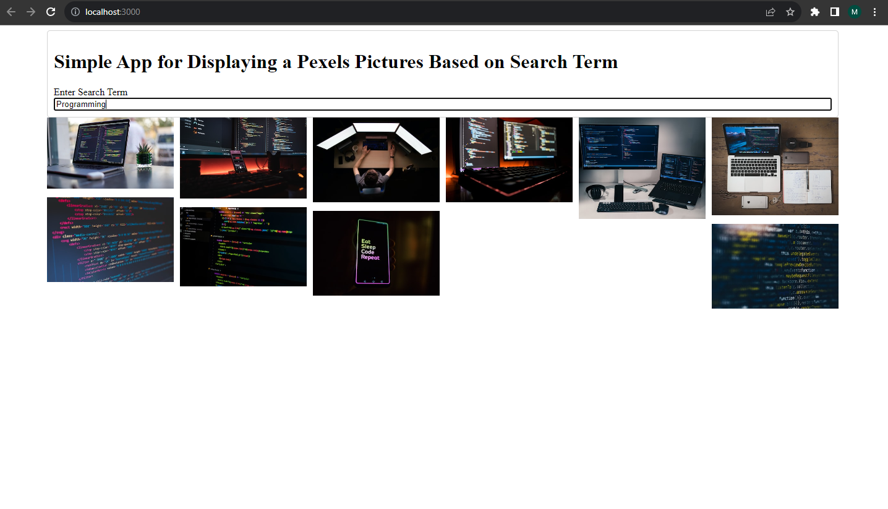

# Pexels API Search App

## Description

The "Pexels API Search App" is a React-based web application that allows users to search for high-quality images from the Pexels API. Simply type in keywords like "forest," "ocean," or any other term, and the app will load 10 relevant images for you to explore and use.

## Features

- Search for images using keywords.
- View a collection of 10 high-quality images based on your search.
- Click on an image to see a larger version and more details.
- Responsive design for various screen sizes.

## Installation

To run this app locally, follow these steps:

1. Clone this repository to your local machine.

git clone https://github.com/Djomlica/pexels-search-app__react

2. Navigate to the project directory.

3. Install the required dependencies.

4. Start the development server.

npm install

5. Open your web browser and visit [http://localhost:3000](http://localhost:3000) to use the app.

## Technologies Used

- React
- Pexels API

## Contributing

If you would like to contribute to this project, please follow these steps:

1. Fork the repository.
2. Create a new branch for your feature or bug fix.
3. Make your changes and commit them.
4. Push your changes to your fork.
5. Submit a pull request to the original repository.
